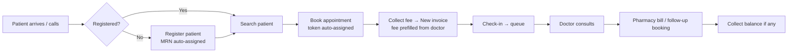
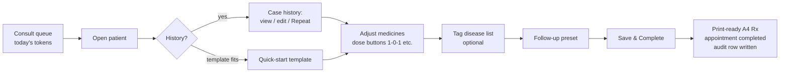
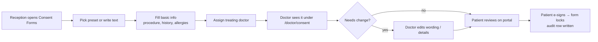

# Clinicore — User Journeys, Workflows & Screen Inventory

## 1. Reception workflow (front desk)

Reception can: register/edit patients, book/reschedule/cancel appointments, manage the day queue
(date filter + status dropdown per row), create consultation invoices + pharmacy bills, collect
full/partial payments, print invoices, export lists. Everything is branch-scoped.

## 2. Doctor workflow (the 2-minute consult)

Entry points: sidebar **Consult** (today's queue) · dashboard schedule. The consult screen preloads
the visit reason as the first complaint and shows allergy warnings inline.

**Previous history**: the case-history panel lists every earlier prescription with its full medicine
lines, advice and follow-up date, and three actions per visit — **Repeat** (merges it into the
current consultation), **View** (print layout) and **Edit** (revise that prescription in place).

**Disease tagging**: the consult screen shows the doctor's condition lists; one click adds the
patient, or a new list can be created inline and seeded with this patient.

## 3. Appointment lifecycle

`SCHEDULED → CONFIRMED → CHECKED_IN → IN_PROGRESS → COMPLETED`
with side exits to `CANCELLED` / `NO_SHOW` (both reversible to `SCHEDULED`) and
`RESCHEDULED` (new slot, clash-checked, then re-confirmed). Walk-ins enter at `CHECKED_IN`.
Completing happens automatically when the doctor saves the consultation.

## 4. Billing workflow

- **Consultation invoice**: patient + doctor (fee prefilled) → discount → GST slab → collected-now
  (PAID) or bill-later (ISSUED with balance).
- **Pharmacy bill**: inventory-backed lines → per-medicine stock validation (aggregated) →
  all-or-nothing deduction with SALE movements → 12% GST → PAID.
- **Collect payment**: any invoice with balance → full/partial (cash/card/UPI) →
  `PARTIALLY_PAID` … `PAID`. Every step audit-logged and 2-dp rounded.

## 4b. Consent workflow

Rules: only the **assigned** doctor may edit; a **signed** form can no longer be edited by anyone;
patients can only sign their own forms.

## 5. Notification flow

Trigger (booking / low stock / payment / expiry) → notification row (type, channel WHATSAPP/EMAIL/SMS/IN_APP,
status) → in-app centre per role (mark one/all read). The rows are the queue contract: a future worker
consumes unsent rows and dispatches to the real WhatsApp/email/SMS providers — no UI change needed.

## 5b. Global search

`Cmd/Ctrl+K` anywhere in the app (or the topbar search bar / mobile search icon) opens a command
palette. Typing fans a single query out across every module the signed-in role may view —
patients, appointments, prescriptions, invoices, doctors, medicines, consent forms — using the
same scoping as the list pages (a doctor only sees their own patients/appointments, a receptionist
only their branch, a patient only their own records). Selecting a hit deep-links into its
role-prefixed route (e.g. `/admin/patients/pat_arjun`).

## 6. Referral workflow (data model ready, UI planned)

Patient carries `referredBy` (doctor / hospital / friend / Google / social / existing patient / corporate).
Analytics roll up: referrals per source, disease-wise, doctor-wise, conversion and revenue per source.
Planned dashboard mirrors the existing analytics page patterns (Recharts wrappers already reusable).

## 7. Screen inventory (~50 routes)

| Area | Screens |
|---|---|
| Auth | Login (role switcher today; email/OTP later) |
| Admin | Dashboard · Analytics · Reports · Calendar · Appointments · Patients (+profile) · Prescriptions (+detail) · Consent · Billing (+invoice) · Inventory · Notifications · Branches · Doctors · Receptionists · Leave & Roster · Insurance · Masters · **Administrators** · Roles & Access · Audit Log · Settings |
| Doctor | Dashboard · **Consult queue** · **Consult screen** · Appointments · My Patients (+profile) · **Disease Lists** · Prescriptions (+print, **+edit**) · **Rx Design** · **Consent Forms** · Calendar · Roster & Leave · Notifications |
| Reception | Dashboard · Appointments · Patients (+profile) · Billing (+invoice) · **Consent Forms** · Calendar · Notifications |
| Patient portal | Overview · Appointments (self-booking) · Prescriptions (+print) · Medical Records · Consent (e-sign) · Billing (+invoice) · Notifications |

Navigation is generated per role from `src/config/navigation.ts`; every section is wrapped by its
role layout + edge middleware. Mobile: collapsible sidebar → sheet drawer (auto-closes on navigation),
all tables in horizontal-scroll containers, dialogs scroll within the viewport.

## 8. Dashboard design

Role-tuned KPI tiles + charts:
- **Admin**: today's appointments/collection/patients, low stock, weekly revenue (area), today-by-status (donut), weekly volume (bar), low-stock list, today's schedule, notifications, activity feed.
- **Doctor**: my day — queue, next patient, pending follow-ups.
- **Reception**: branch day view — queue, waiting, unpaid invoices.
- **Patient**: next appointment, recent prescriptions, outstanding bills.
